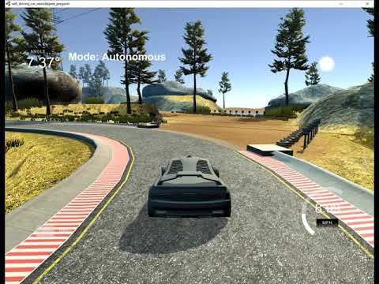
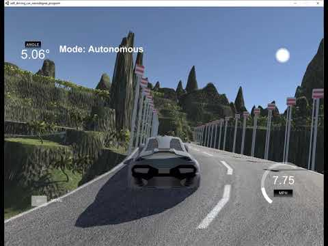

## Introduction
This project aims to develop a self-driving car system utilizing cutting-edge computer vision, machine learning, and technologies.

### 1. The project includes the following files:

My project includes the following files:
- `behavioral_cloning_main.ipyb` normal model
- `behavioral_cloning_transfer.ipyb` model_trained_using transfer learning
- `drive.py` for driving the car in autonomous mode
- `model.h5` the trained convolution neural network

## Dataset
The self-driving was obtained from driving several lap around the
unity self driving car simulator 

## Simulator
The self-driving car system can be tested using the car_simulator from Unity. This simulator provides a realistic 3D environment.

## Usage
1. Clone the repository.
2. Install the required dependencies (e.g., TensorFlow, PyTorch, OpenCV, Flask, Socket.IO).
3. Preprocess and augment the dataset as needed.
4. Train and validate the models for perception, localization, mapping, planning, and control.
5. Integrate the models into the self-driving car system.
6. Deploy the Flask and Socket.IO server.
7. Test the system in the car_simulator from Unity or on a real vehicle, ensuring safety and compliance with local regulations.

## Results
Detailed results and explanation can be found in my published article:
[https://www.ej-eng.org/index.php/ejeng/article/view/2537](https://www.ej-eng.org/index.php/ejeng/article/view/2537)
Reference as:
Sokipriala, Jonah. "Prediction of Steering Angle for Autonomous Vehicles Using Pre-Trained Neural Network." European Journal of Engineering and Technology Research 6.5 (2021): 171-176.
